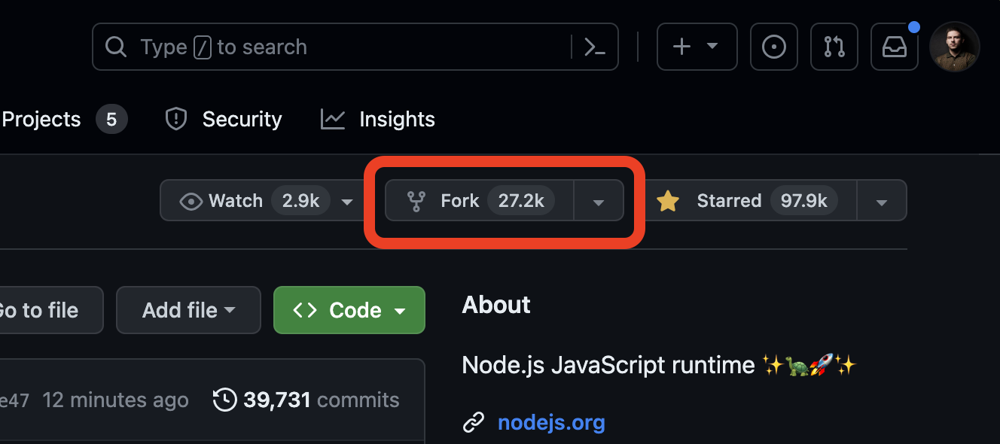
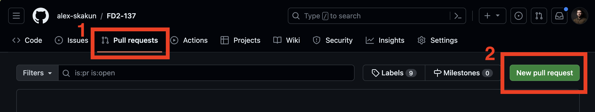
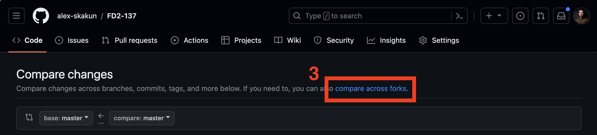
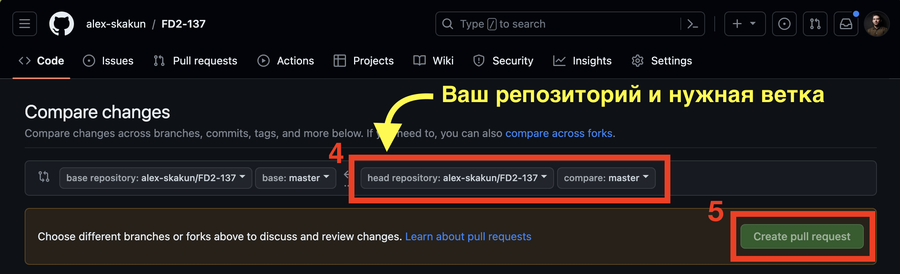

Домашние работы FD-2
====================

- [ДЗ №1](./homework-1)
- [ДЗ №2](./homework-2)
- [ДЗ №3](./homework-3)
- [ДЗ №4](./homework-4)
- [ДЗ №5](./homework-5)
- [ДЗ №6](./homework-6)
- [ДЗ №7](./homework-7)

## Необходимое ПО

- Git [скачать](https://git-scm.com/downloads)
- node.js LTS [скачать](https://nodejs.org/ru)

## Инструкция

- Сделайте fork данного репозитория в свой аккаунт
  
- Клонируйте новый репозиторий из своего аккаунта на свой компьютер
- В корневой директории клонированного репозитория выполните команду `npm ci` для установки необходимых зависимостей
- После клонировния перейдите в директорию с домашним заданием, например `homework-1`
- Ознакомьтесь с заданием в файле `README.md` в директории выбранного домашнего задания
- Выполните домашнее задание в выбранной директории
- После выполнения задания сделайте `commit` всех изменений. Убедитесь, что все созданные вами файлы были добавлены в репозиторий в директорию конкретного домашнего задания
- Сделайте `push` в свой репозиторий на GitHub
- Откройте Pull Request из своего репозитория в данный репозиторий
  
  
  
